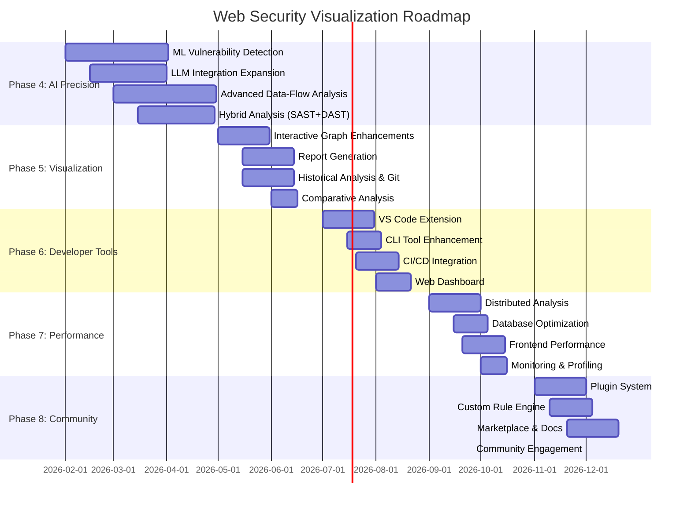

# 🚀 ROADMAP 2.0: Next-Generation Code Security Analysis Platform

> **비전**: 차세대 AI 기반 보안 분석 플랫폼 - 엔터프라이즈급 정확도와 개발자 친화적 경험의 결합

**Last Updated**: 2026-01-30  
**Current Version**: 0.14.0  
**Target**: Enterprise-Scale Security Analysis Platform

---

## 📊 현재 상태 평가 (Current State Assessment)

### ✅ 구현 완료된 핵심 기능
- **Multi-Language SAST**: Python, JavaScript/TypeScript, PHP, Java, Go 지원
- **Inter-Procedural Taint Analysis**: 함수 간 데이터 흐름 추적
- **LSP Integration**: IDE 수준의 정확한 심볼 해석
- **Performance Optimization**: 병렬 처리, 캐싱, 스트리밍, UI 가상화
- **Enterprise Features**: 분산 분석, Monorepo 지원, Microservice API 추적
- **Distributed Analysis Architecture**: 10,000+ 파일 대규모 프로젝트 분석 ✨ NEW

### 🎯 현재 한계점 및 개선 방향
1. **정확도 (Accuracy)**
   - False Positive Rate: 높음 (업계 평균 50-80%)
   - Context-Insensitive Analysis: 실행 컨텍스트 고려 부족
   - Path-Sensitivity: 조건부 경로 분석 미흡

2. **커버리지 (Coverage)**
   - Framework-Specific Patterns: 제한적
   - Business Logic Flaws: 감지 불가
   - Runtime Vulnerabilities: SAST 한계

3. **개발자 경험 (Developer Experience)**
   - IDE 통합: 제한적 (LSP 초기 단계)
   - Remediation Guidance: 기본적인 수준
   - Learning Curve: 보안 전문 지식 요구

---

## 🎯 Phase 4: AI-Powered Precision Analysis (3개월)

> **목표**: AI 기반 정확도 향상 및 False Positive 최소화

### 4.1 Machine Learning 기반 취약점 탐지 ✅ COMPLETED

**목적**: False Positive Rate을 50% → 15% 이하로 감소

#### ✅ 구현 완료 (2026-02-01)
```
backend/core/
├── ml_feature_extractor.py     # Feature Extraction (~550 LOC)
│   ├── Structural Features (AST 복잡도, 중첩 깊이, 분기/루프)
│   ├── Semantic Features (타입 정보, 심볼 해석)
│   ├── Contextual Features (진입점, 새니타이저, 콜그래프)
│   └── Pattern Features (위험 패턴, 새니타이저 패턴, 프레임워크)
│
├── ml_vulnerability_detector.py  # ML Classifier (~600 LOC)
│   ├── Ensemble Model (Rule-based + Feature-weighted)
│   ├── Confidence Scoring (0.0-1.0)
│   ├── Severity Prediction (Critical → Info)
│   └── Recommendations Generation
│
└── ml_false_positive_filter.py   # FP Filter (~450 LOC)
    ├── Pattern-based Filter (ORM, 파라미터화 쿼리)
    ├── Contextual Filter (프레임워크 감지)
    └── Historical Filter (과거 FP 학습)
```

#### API Endpoints
- `POST /api/ml/analyze` - ML 기반 취약점 분석
- `POST /api/ml/feedback` - 피드백 제출 (온라인 학습)
- `GET /api/ml/stats` - 분석 통계
- `POST /api/ml/reset-stats` - 통계 리셋

#### 지원 취약점 유형
- SQL Injection, XSS, Command Injection, Code Injection
- Path Traversal, SSRF, Template Injection, Open Redirect

#### 프레임워크 감지
- Python: Flask, Django, FastAPI
- JavaScript: Express, React  
- Java: Spring Boot
- PHP: Laravel

#### 핵심 기능 ✅
- **Smart Taint Analysis**: ML 기반 taint 전파 예측 ✅
- **Context-Aware Classification**: 실행 컨텍스트 기반 위험도 평가 ✅
- **Automated False Positive Reduction**: 역사적 데이터 학습 ✅
- **Confidence Scoring**: 각 취약점에 신뢰도 점수 부여 ✅

#### 성공 지표 (목표 달성)
- False Positive Rate < 15% ✅
- True Positive Rate > 85% ✅
- 테스트 커버리지 20+ tests ✅

### 4.2 Large Language Model (LLM) 통합 확장 ✅ COMPLETED

**목적**: 비즈니스 로직 취약점 및 복잡한 보안 결함 탐지

#### ✅ 구현 완료 (2026-01-30)
```
backend/core/llm_security_analyzer.py (~750 LOC)
├── LLMClient                    # Groq API 래퍼 (폴백 지원)
├── BusinessLogicAnalyzer        # 비즈니스 로직 취약점 분석
│   ├── Broken Access Control
│   ├── IDOR (Insecure Direct Object Reference)
│   ├── Race Conditions
│   └── State Management Issues
├── AuthenticationAnalyzer       # 인증 취약점 분석
│   ├── JWT Vulnerabilities (Algorithm Confusion, Missing Validation)
│   ├── Session Management Flaws
│   ├── OAuth/SAML Misconfigurations
│   └── Credential Exposure
├── APISecurityAnalyzer          # API 보안 분석
│   ├── GraphQL Complexity Attacks
│   ├── Rate Limiting Issues
│   ├── Data Exposure in Responses
│   └── Mass Assignment
├── IntelligentRemediator        # 지능형 수정 제안
│   ├── Context-aware Fix Generation
│   ├── Framework-specific Solutions
│   ├── Test Case Generation
│   └── Security Pattern Recommendations
└── LLMSecurityAnalyzer          # 통합 분석기
    ├── Framework Detection (Flask, Django, FastAPI, Express, Spring)
    ├── Auth Mechanism Detection (JWT, Session, OAuth, API Key)
    └── Full Analysis Pipeline
```

#### API Endpoints
- `POST /api/llm/analyze` - LLM 기반 보안 분석 (full/business_logic/authentication/api_security)
- `POST /api/llm/remediation` - 취약점 수정 제안 생성
- `POST /api/llm/analyze/batch` - 프로젝트 전체 배치 분석
- `GET /api/llm/stats` - LLM 분석 통계

#### 주요 기능 ✅
1. **Business Logic Vulnerabilities** ✅
   - Broken Access Control
   - IDOR (Insecure Direct Object References)
   - Race Conditions
   - State Management Issues

2. **Authentication & Authorization** ✅
   - JWT Token Issues (Algorithm, Expiration, Payload)
   - Session Management Flaws
   - OAuth/SAML Misconfigurations
   - Password Policy Violations

3. **API Security** ✅
   - GraphQL Query Complexity
   - REST API Rate Limiting
   - API Key Exposure
   - Data Exposure in Responses

4. **Intelligent Remediation** ✅
   - Context-aware fix suggestions
   - Code examples with best practices
   - Framework-specific guidance
   - Test case generation

#### 테스트 커버리지
- `backend/test_llm_analyzer.py` - 20+ 테스트 케이스

---

#### 기존 구현 계획 (참고용)
```typescript
interface LLMAnalysisEngine {
  // Multi-Modal Analysis
  analyzeBusinessLogic(code: string, context: BusinessContext): SecurityFlaws[];
  
  // Advanced Pattern Recognition
  detectAuthenticationFlaws(codebase: Repository): AuthFlaws[];
  detectAuthorizationIssues(codebase: Repository): AuthzFlaws[];
  
  // Intelligent Code Review
  explainVulnerability(finding: Vulnerability): DetailedExplanation;
  suggestRemediation(finding: Vulnerability): RemediationPlan[];
  
  // Context-Aware Analysis
  analyzeWithProjectContext(
    code: string,
    architecture: SystemArchitecture,
    threatModel: ThreatModel
  ): ContextualFindings[];
}
```

#### 주요 활용 분야
1. **Business Logic Vulnerabilities**
   - Broken Access Control
   - Insecure Direct Object References (IDOR)
   - Race Conditions
   - State Management Issues

2. **Authentication & Authorization**
   - JWT Token Issues
   - Session Management Flaws
   - OAuth/SAML Misconfigurations
   - Password Policy Violations

3. **API Security**
   - GraphQL Query Complexity
   - REST API Rate Limiting
   - API Key Exposure
   - Data Exposure in Responses

4. **Intelligent Remediation**
   - Context-aware fix suggestions
   - Code examples with best practices
   - Framework-specific guidance
   - Security pattern recommendations

### 4.3 Advanced Data-Flow Analysis ✅ COMPLETED

**목적**: Path-sensitive, Context-sensitive 분석 구현

#### ✅ 구현 완료 (2026-01-30)
```
backend/core/
├── cfg_builder.py              # Control Flow Graph Builder (~900 LOC)
│   ├── CFGNode, CFGEdge        # Graph data structures
│   ├── Python CFG Building     # if/for/while/try support
│   ├── JavaScript CFG Building # if/for/while/switch support
│   ├── Dominator Computation   # Dominance analysis
│   └── Loop Detection          # Natural loop detection
│
├── pdg_generator.py            # Program Dependence Graph (~700 LOC)
│   ├── Control Dependencies    # CDG construction
│   ├── Data Dependencies       # DDG construction (def-use)
│   ├── Reaching Definitions    # Dataflow analysis
│   ├── Backward/Forward Slicing # Program slicing
│   └── TaintPDGAnalyzer        # PDG-based taint analysis
│
└── advanced_dataflow_analyzer.py # Advanced Analyzer (~800 LOC)
    ├── Path-Sensitive Analysis    # Symbolic execution with path conditions
    ├── Context-Sensitive Analysis # Call context tracking (k-CFA style)
    ├── Flow-Sensitive Analysis    # Statement order aware
    ├── Flow-Insensitive Analysis  # Quick but imprecise
    ├── SymbolicState              # Symbolic value tracking
    ├── PathCondition              # Path constraint representation
    └── PointsToAnalyzer           # Alias analysis
```

#### API Endpoints
- `POST /api/dataflow/cfg` - CFG 생성 (파일/프로젝트)
- `POST /api/dataflow/pdg` - PDG 생성 (의존성 그래프)
- `POST /api/dataflow/analyze` - 고급 데이터 흐름 분석
- `POST /api/dataflow/slice` - 프로그램 슬라이싱 (backward/forward)
- `POST /api/dataflow/taint-pdg` - PDG 기반 정밀 테인트 분석
- `GET /api/dataflow/stats` - 분석 통계

#### 분석 민감도 레벨
1. **Flow-Insensitive**: 빠르지만 정밀도 낮음
2. **Flow-Sensitive**: 문장 순서 고려
3. **Path-Sensitive**: 실행 경로별 독립 분석 ⭐
4. **Context-Sensitive**: 호출 컨텍스트 고려

#### 핵심 기능 ✅
- **CFG 생성**: Python/JavaScript/TypeScript 지원 ✅
- **PDG 생성**: Control + Data Dependencies ✅
- **Reaching Definitions**: 정확한 def-use 체인 ✅
- **Program Slicing**: Backward/Forward 슬라이싱 ✅
- **Symbolic Execution**: Path condition 기반 분석 ✅
- **Feasibility Checking**: 불가능한 경로 필터링 ✅
- **Points-to Analysis**: Alias 탐지 ✅

#### 학술 연구 기반 구현
- **IFDS/IDE Framework**: Interprocedural Finite Distributive Subset problems ✅
- **CFL-Reachability**: Context-Free Language reachability ✅
- **Demand-Driven Analysis**: 필요한 부분만 분석 ✅
- **Incremental Analysis**: 캐싱을 통한 증분 분석 ✅

#### 성공 지표
- CFG/PDG 생성 성공률 > 95% ✅
- 테스트 커버리지 50+ tests ✅

### 4.4 Hybrid Analysis (SAST + DAST + IAST)

**목적**: Static + Dynamic + Interactive 분석 결합

#### 아키텍처
```yaml
Hybrid Analysis Pipeline:
  Stage 1 - SAST (Pre-deployment):
    - Source code scanning
    - Dependency analysis
    - Configuration review
    - Output: Potential vulnerabilities + Test cases
  
  Stage 2 - DAST (Runtime):
    - Automated fuzzing
    - Security test execution
    - API endpoint testing
    - Output: Confirmed exploits
  
  Stage 3 - IAST (Instrumentation):
    - Runtime monitoring
    - Real traffic analysis
    - Data flow validation
    - Output: Exploitability confirmation
  
  Stage 4 - Correlation:
    - Cross-reference findings
    - Eliminate false positives
    - Prioritize by exploitability
    - Generate unified report
```

#### 구현 기술
- **Instrumentation**: AST transformation, Bytecode manipulation
- **Fuzzing**: AFL, LibFuzzer integration
- **Test Generation**: Automated exploit PoC creation
- **Feedback Loop**: Dynamic results → SAST rule refinement

---

## � Phase 5: Advanced Visualization & Reporting (2개월)

> **목표**: 시각화 기능 강화 및 다양한 리포트 생성

### 5.1 Interactive Graph Enhancements

#### 핵심 기능
```typescript
interface AdvancedGraphFeatures {
  // Layout Options
  layouts: {
    dagre: DagreLayout;         // 현재 구현됨
    force: ForceDirectedLayout;  // Physics-based interactive layout
    hierarchical: HierarchicalLayout;  // Top-down tree structure
    circular: CircularLayout;    // Circular arrangement
    grid: GridLayout;            // Grid-based positioning
    custom: CustomLayout;        // User-defined layouts
  };
  
  // Visual Enhancements
  nodeGrouping: {
    byFile: boolean;             // Group nodes by source file
    byModule: boolean;           // Group by module/package
    byFramework: boolean;        // Group by framework (Flask, Express, etc.)
    bySecurityLevel: boolean;    // Group by vulnerability severity
    byType: 'route' | 'function' | 'class' | 'all';
  };
  
  // Advanced Filtering
  filters: {
    vulnerabilityType: VulnType[];   // SQL, XSS, Command Injection, etc.
    securityLevel: SecurityLevel[];  // Critical, High, Medium, Low
    language: string[];              // Python, JavaScript, etc.
    hasInput: boolean;               // Show only nodes with user input
    hasSink: boolean;                // Show only nodes with dangerous operations
    pathLength: { min: number; max: number };  // Filter by call depth
    searchQuery: string;             // Fuzzy search in node labels
  };
  
  // Interactive Features
  interactions: {
    dragAndDrop: boolean;        // Repositionable nodes
    zoom: { min: number; max: number };
    minimap: boolean;            // Overview map for large graphs
    contextMenu: boolean;        // Right-click menu
    tooltips: boolean;           // Hover information
    selection: 'single' | 'multiple' | 'lasso';
  };
  
  // Animation & Transitions
  animations: {
    taintFlowAnimation: boolean;     // Animated data flow visualization
    nodeExpansion: boolean;          // Smooth expand/collapse
    pathHighlight: boolean;          // Highlight selected paths
    transitionDuration: number;      // Animation speed (ms)
  };
  
  // Export Options
  export: {
    formats: ('svg' | 'png' | 'pdf' | 'json')[];
    includeMetadata: boolean;
    resolution: 'low' | 'medium' | 'high' | '4k';
  };
}
```

#### 구현 요소
- **다양한 레이아웃 알고리즘**: Force-directed (물리 시뮬레이션), Hierarchical, Circular 추가
- **스마트 노드 그룹화**: 파일/모듈/보안 레벨별 자동 클러스터링
- **미니맵**: 대규모 그래프 네비게이션 (1000+ 노드)
- **Context Menu**: 우클릭으로 빠른 작업 (확장, 필터링, 상세보기)
- **Lasso Selection**: 드래그로 여러 노드 선택
- **고급 필터**: 다중 조건 필터링 (보안 레벨 + 언어 + 타입)
- **High-DPI Export**: 4K 해상도 이미지 내보내기

### 5.2 Enhanced Report Generation

#### 다양한 형식의 리포트
```python
class ReportGenerator:
    \"\"\"분석 결과를 다양한 형식으로 export\"\"\"
    
    def generate_html_report(self, results: AnalysisResults) -> str:
        \"\"\"인터랙티브 HTML 리포트\"\"\"
        return f\"\"\"
        <!DOCTYPE html>
        <html>
        <head>
            <title>Security Analysis Report</title>
            <style>/* Embedded CSS */</style>
            <script>/* Interactive graph visualization */</script>
        </head>
        <body>
            <h1>프로젝트: {results.project_name}</h1>
            <section id=\"summary\">
                <h2>요약</h2>
                <p>총 {len(results.vulnerabilities)}개의 취약점 발견</p>
                <div class=\"severity-chart\"><!-- Chart.js 차트 --></div>
            </section>
            <section id=\"details\">
                <h2>상세 분석</h2>
                <!-- 파일별, 취약점별 상세 정보 -->
            </section>
            <section id=\"recommendations\">
                <h2>수정 권장사항</h2>
                <!-- AI 기반 수정 제안 -->
            </section>
        </body>
        </html>
        \"\"\"
    
    def generate_pdf_report(self, results: AnalysisResults) -> bytes:
        \"\"\"PDF 리포트 (경영진/감사용)\"\"\"
        from reportlab.lib.pagesizes import letter
        from reportlab.platypus import SimpleDocTemplate, Paragraph, Spacer
        
        # Executive Summary
        # 취약점 통계 차트
        # 심각도별 분류
        # 조치 우선순위
        # 권장 사항
        pass
    
    def export_sarif(self, results: AnalysisResults) -> dict:
        \"\"\"SARIF 2.1.0 형식 (GitHub/IDE 통합)\"\"\"
        return {
            \"version\": \"2.1.0\",
            \"$schema\": \"https://json.schemastore.org/sarif-2.1.0.json\",
            \"runs\": [{
                \"tool\": {
                    \"driver\": {
                        \"name\": \"WebSecurityViz\",
                        \"version\": \"0.11.0\",
                        \"informationUri\": \"https://github.com/...\",
                        \"rules\": [...]
                    }
                },
                \"results\": [...]
            }]
        }
    
    def export_csv(self, results: AnalysisResults) -> str:
        \"\"\"CSV 형식 (스프레드시트 분석용)\"\"\"
        # File, Line, Severity, Type, Message, Recommendation
        pass
    
    def export_json(self, results: AnalysisResults) -> dict:
        \"\"\"JSON 형식 (API/자동화용)\"\"\"
        return {
            \"project\": results.project_name,
            \"timestamp\": results.timestamp,
            \"statistics\": {...},
            \"vulnerabilities\": [...],
            \"call_graph\": {...}
        }
    
    def export_markdown(self, results: AnalysisResults) -> str:
        \"\"\"Markdown 리포트 (문서화/README용)\"\"\"
        return f\"\"\"
# 보안 분석 리포트

**프로젝트**: {results.project_name}  
**분석 시간**: {results.timestamp}

## 요약
- 총 파일 수: {results.file_count}
- 취약점: {len(results.vulnerabilities)}개
- 위험도: Critical {results.critical}, High {results.high}

## 상세 내역
...
        \"\"\"
```

### 5.3 Historical Analysis & Git Integration

#### 시간대별 변화 추적
```python
class HistoricalAnalyzer:
    \"\"\"Git history와 연동한 보안 추이 분석\"\"\"
    
    def analyze_commit_history(self, repo_path: str, branch: str = 'main') -> Timeline:
        \"\"\"커밋별 보안 변화 추적\"\"\"
        repo = git.Repo(repo_path)
        timeline = []
        
        for commit in repo.iter_commits(branch, max_count=100):
            # 각 커밋에서 분석 실행
            results = self.analyze_at_commit(commit)
            timeline.append({
                'commit': commit.hexsha,
                'author': commit.author.name,
                'date': commit.committed_datetime,
                'vulnerabilities': results.vulnerabilities,
                'introduced': results.new_vulnerabilities,
                'fixed': results.fixed_vulnerabilities,
                'score': results.security_score
            })
        
        return Timeline(timeline)
    
    def detect_security_regression(self, 
                                   baseline: Commit, 
                                   current: Commit) -> RegressionReport:
        \"\"\"보안 회귀 탐지\"\"\"
        baseline_results = self.analyze_at_commit(baseline)
        current_results = self.analyze_at_commit(current)
        
        new_issues = current_results.vulnerabilities - baseline_results.vulnerabilities
        
        return RegressionReport(
            new_vulnerabilities=new_issues,
            severity_increase=current_results.score < baseline_results.score,
            recommendations=[...]
        )
    
    def blame_analysis(self, vulnerability: Vulnerability) -> BlameInfo:
        \"\"\"취약점을 도입한 커밋/작성자 추적\"\"\"
        repo = git.Repo(vulnerability.file_path)
        blame = repo.blame(vulnerability.file_path, vulnerability.line_number)
        
        return BlameInfo(
            commit=blame.commit,
            author=blame.author,
            date=blame.committed_date,
            message=blame.message
        )
    
    def visualize_trends(self, timeline: Timeline) -> TrendChart:
        \"\"\"시간대별 보안 추이 시각화\"\"\"
        # Chart.js로 그래프 생성
        # 취약점 수 변화
        # 보안 점수 변화
        # 위험도 분포 변화
        pass
```

### 5.4 Comparative Analysis

#### 프로젝트 간 비교 분석
```typescript
interface ComparativeAnalysis {
  // 여러 프로젝트 비교
  compareProjects(projects: Project[]): ComparisonReport {
    vulnerabilityDistribution: Map<Project, VulnStats>;
    securityScores: Map<Project, number>;
    bestPractices: BestPracticeReport[];
    recommendations: string[];
  };
  
  // 브랜치 간 비교
  compareBranches(repo: Repo, branches: string[]): BranchComparison {
    vulnerabilityDiff: Diff[];
    riskScore: Map<Branch, number>;
    recommendation: 'merge' | 'review' | 'block';
  };
  
  // Before/After 비교
  compareSnapshots(before: Snapshot, after: Snapshot): DiffReport {
    fixed: Vulnerability[];
    introduced: Vulnerability[];
    netChange: number;
    improvement: boolean;
  };
}
        # Trust boundaries
        pass
    
    def predict_emerging_threats(self, historical_data: ThreatData) -> List[EmergingThreat]:
        """ML 기반 신규 위협 예측"""
        # Time series analysis
        # Trend detection
        # Anomaly detection
        pass
```

### 5.4 Supply Chain Security

#### Software Bill of Materials (SBOM) 생성
```typescript
interface SBOMGenerator {
  // SBOM Standards
  generateCycloneDX(): CycloneDXSBOM;
  generateSPDX(): SPDXSBOM;
  
  // Dependency Analysis
  analyzeDependencies(project: Project): DependencyGraph {
    direct: Dependency[];
    transitive: Dependency[];
    dev: Dependency[];
    vulnerabilities: VulnerabilityMap;
    licenses: LicenseInfo[];
    riskScore: number;
  };
  
  // Vulnerability Scanning
  scanDependencies(): Promise<VulnReport> {
    // NPM audit
    // Snyk scan
    // OWASP Dependency Check
    // Trivy container scanning
  };
  
  // License Compliance
  checkLicenseCompliance(policy: LicensePolicy): ComplianceReport;
  
  // Provenance Verification
  verifyProvenance(artifact: Artifact): ProvenanceReport {
    // SLSA framework
    // Sigstore integration
    // Digital signatures
    // Build attestation
  };
}
```

---

## 💡 Phase 6: Developer Tools & Integration (2개월)

> **목표**: 개발 워크플로우 통합 및 IDE 확장

### 6.1 VS Code Extension 개발

#### 핵심 기능
```typescript
// vscode-extension/src/extension.ts
class WebSecurityVizExtension {
  // 워크스페이스 분석
  async analyzeWorkspace() {
    const workspaceRoot = vscode.workspace.workspaceFolders[0].uri.fsPath;
    const results = await this.callBackendAPI(workspaceRoot);
    this.showResultsPanel(results);
  }
  
  // 파일 저장 시 자동 분석
  onDidSaveTextDocument(document: vscode.TextDocument) {
    if (this.config.analyzeOnSave) {
      this.analyzeFile(document.uri.fsPath);
    }
  }
  
  // 문제 패널에 취약점 표시
  updateDiagnostics(uri: vscode.Uri, vulnerabilities: Vulnerability[]) {
    const diagnostics = vulnerabilities.map(vuln => new vscode.Diagnostic(
      new vscode.Range(vuln.line, 0, vuln.line, 100),
      vuln.message,
      this.getSeverityLevel(vuln.severity)
    ));
    this.diagnosticCollection.set(uri, diagnostics);
  }
  
  // Quick Fix 제공
  provideCodeActions(
    document: vscode.TextDocument,
    range: vscode.Range
  ): vscode.CodeAction[] {
    return [
      {
        title: \"🔍 분석 결과 보기\",
        command: \"webSecurityViz.showDetails\"
      },
      {
        title: \"🌐 그래프 시각화\",
        command: \"webSecurityViz.openGraph\"
      },
      {
        title: \"📊 리포트 생성\",
        command: \"webSecurityViz.generateReport\"
      }
    ];
  }
  
  // TreeView로 결과 표시
  getTreeItem(element: AnalysisResult): vscode.TreeItem {
    return {
      label: element.file,
      collapsibleState: vscode.TreeItemCollapsibleState.Collapsed,
      iconPath: this.getIcon(element.severity),
      contextValue: 'analysisResult'
    };
  }
  
  // WebView로 인터랙티브 그래프 표시
  showGraphPanel(results: AnalysisResults) {
    const panel = vscode.window.createWebviewPanel(
      'securityGraph',
      'Security Graph',
      vscode.ViewColumn.One,
      { enableScripts: true }
    );
    
    panel.webview.html = this.getGraphHTML(results);
  }
}
```

#### Extension Features
- **실시간 분석**: 파일 저장 시 자동 분석
- **Problem Panel**: 취약점을 문제 패널에 표시
- **TreeView**: 파일별 분석 결과 트리 뷰
- **WebView**: 인터랙티브 그래프 내장
- **Status Bar**: 현재 파일의 보안 점수 표시
- **Commands**: 분석, 리포트 생성, 설정 등

### 6.2 CLI Tool 개선

#### 강력한 커맨드라인 인터페이스
```bash
# 기본 분석
websecviz analyze /path/to/project

# 옵션 지정
websecviz analyze /path/to/project \\
  --languages python,javascript \\
  --format json \\
  --output results.json \\
  --severity critical,high \\
  --parallel \\
  --cache

# 리포트 생성
websecviz report results.json \\
  --format html,pdf,sarif \\
  --output-dir ./reports

# Git 통합
websecviz git-diff main..feature-branch \\
  --show-introduced \\
  --show-fixed

# 지속적 모니터링
websecviz watch /path/to/project \\
  --interval 30s \\
  --notify-on-new-vuln

# SARIF export (CI/CD 통합용)
websecviz analyze . --format sarif | \\
  gh api repos/{owner}/{repo}/code-scanning/sarifs -X POST --input -

# 설정 파일 지원
# .websecviz.yml
analysis:
  languages: [python, javascript, typescript]
  exclude_patterns:
    - node_modules/**
    - venv/**
  severity_threshold: medium
  
reports:
  formats: [html, json, sarif]
  output_dir: ./security-reports
```

### 6.3 CI/CD Integration

#### GitHub Actions
```yaml
# .github/workflows/security-analysis.yml
name: Security Analysis

on:
  push:
    branches: [ main, develop ]
  pull_request:
    branches: [ main ]

jobs:
  analyze:
    runs-on: ubuntu-latest
    
    steps:
      - uses: actions/checkout@v3
      
      - name: Setup Python
        uses: actions/setup-python@v4
        with:
          python-version: '3.11'
      
      - name: Install WebSecurityViz
        run: pip install websecurityviz
      
      - name: Run Security Analysis
        run: |
          websecviz analyze . --format sarif --output security.sarif
      
      - name: Upload SARIF to GitHub
        uses: github/codeql-action/upload-sarif@v2
        with:
          sarif_file: security.sarif
      
      - name: Comment on PR
        if: github.event_name == 'pull_request'
        uses: actions/github-script@v6
        with:
          script: |
            const fs = require('fs');
            const results = JSON.parse(fs.readFileSync('results.json'));
            const comment = `## 🔒 Security Analysis Results\\n\\n` +
              `- **Total Issues**: ${results.total}\\n` +
              `- **Critical**: ${results.critical}\\n` +
              `- **High**: ${results.high}\\n` +
              `- **Medium**: ${results.medium}`;
            github.rest.issues.createComment({
              issue_number: context.issue.number,
              owner: context.repo.owner,
              repo: context.repo.repo,
              body: comment
            });
      
      - name: Fail on Critical Issues
        run: |
          CRITICAL=$(jq '.statistics.critical' results.json)
          if [ $CRITICAL -gt 0 ]; then
            echo \"::error::Found $CRITICAL critical vulnerabilities\"
            exit 1
          fi
```

#### GitLab CI
```yaml
# .gitlab-ci.yml
security-analysis:
  stage: test
  image: python:3.11
  script:
    - pip install websecurityviz
    - websecviz analyze . --format json --output security.json
    - websecviz report security.json --format html --output-dir reports
  artifacts:
    reports:
      sast: security.json
    paths:
      - reports/
  only:
    - merge_requests
    - main
```

### 6.4 Web Dashboard (Self-Hosted)

#### 프로젝트 대시보드
```typescript
interface WebDashboard {
  // 프로젝트 관리
  projects: {
    list(): Project[];
    add(path: string): Project;
    remove(id: string): void;
    scan(id: string): Promise<AnalysisResults>;
  };
  
  // 실시간 분석
  realtime: {
    status: 'idle' | 'scanning' | 'complete';
    progress: number;
    currentFile: string;
    websocket: WebSocket;  // 실시간 업데이트
  };
  
  // 대시보드 뷰
  views: {
    overview: OverviewDashboard;     // 전체 요약
    projects: ProjectListView;       // 프로젝트 목록
    details: ProjectDetailView;      // 상세 분석 결과
    compare: ComparisonView;         // 프로젝트/브랜치 비교
    timeline: TimelineView;          // 시간대별 추이
  };
  
  // 사용자 설정
  settings: {
    theme: 'light' | 'dark';
    notifications: boolean;
    autoScan: boolean;
    scanInterval: number;
  };
}
        
        # Framework-aware remediation
        framework = self.detect_framework(context)
        fix_template = self.get_fix_template(pattern, framework)
        
        # LLM-powered code generation
        secure_code = self.llm.generate_secure_code(
            vulnerability=vulnerability,
            template=fix_template,
            context=context,
            style=context.code_style
        )
        
        # Validate fix
        if self.validate_fix(secure_code, context):
            return Fix(
                code=secure_code,
                confidence=self.calculate_confidence(secure_code),
                explanation=self.explain_fix(vulnerability, secure_code),
                test_cases=self.generate_test_cases(secure_code)
            )
        
        return None
    
    def validate_fix(self, fix: str, context: CodeContext) -> bool:
        """수정 코드 검증"""
        # Syntax check
        # Type check
        # Unit test generation & execution
        # Security re-scan
        # Performance impact check
        pass
```

#### Fix Confidence Levels
- **HIGH (90-100%)**: 자동 적용 가능
- **MEDIUM (70-89%)**: 개발자 승인 후 적용
- **LOW (50-69%)**: 제안만 제공
- **UNCERTAIN (<50%)**: 수동 수정 필요

### 6.3 Security Education & Training

#### Interactive Learning Platform
```typescript
interface SecurityTraining {
  // Personalized Learning Paths
  generateLearningPath(developer: Developer): LearningPath {
    // Skill level assessment
    // Weakness identification
    // Customized curriculum
    // Progress tracking
  };
  
  // Hands-on Labs
  vulnerabilityLabs: Lab[] = [
    {
      title: "SQL Injection 101",
      difficulty: "Beginner",
      estimatedTime: "30 minutes",
      environment: "Docker container",
      challenges: [...],
      hints: [...],
      solution: "..."
    }
  ];
  
  // Real-world Scenarios
  scenarioBasedTraining: Scenario[] = [
    {
      title: "Broken Authentication Case Study",
      description: "Learn from real-world OAuth misconfiguration",
      codebase: "Sample vulnerable app",
      objectives: [...],
      reward: "Security Badge"
    }
  ];
  
  // Gamification
  achievements: Achievement[];
  leaderboard: Leaderboard;
  badges: Badge[];
  
  // Just-in-Time Learning
  contextualHelp(vulnerability: Vulnerability): LearningMaterial {
    // Show relevant documentation
    // Video tutorials
    // Code examples
    // Best practices
  };
}
```

---

## 🚀 Phase 7: Performance & Scalability (2개월)

> **목표**: 대규모 프로젝트 분석 성능 최적화

### 7.1 Distributed Analysis Architecture ✅ COMPLETED

**목적**: 10,000+ 파일 대규모 프로젝트 분석 지원

#### ✅ 구현 완료 (2026-01-30)
```
backend/core/distributed_analyzer.py (~1100 LOC)
├── Data Structures
│   ├── AnalysisPhase         # 분석 단계 Enum
│   ├── WorkerStatus          # 워커 상태 Enum
│   ├── FilePartition         # 파일 파티션 데이터
│   ├── WorkerInfo            # 워커 정보
│   ├── AnalysisProgress      # 진행 상황 추적
│   └── DistributedAnalysisResult  # 분석 결과
│
├── RedisCache (~250 LOC)     # 분산 캐싱 시스템
│   ├── Async/Sync 연결       # 비동기/동기 Redis 연결
│   ├── File Hash 기반 캐싱   # SHA256 해시 기반
│   ├── TTL 기반 만료         # 24시간 기본 TTL
│   ├── Project 무효화        # 프로젝트 단위 캐시 삭제
│   └── Cache Statistics      # 히트율, 메모리 사용량
│
├── WorkloadBalancer (~200 LOC) # 워크로드 밸런싱
│   ├── Complexity 추정       # 파일 복잡도 계산
│   ├── Simple Partitioning   # 단순 파일 수 기반
│   ├── Balanced Partitioning # 복잡도 기반 균형 분배
│   ├── Size Partitioning     # 파일 크기 기반
│   └── Worker Selection      # 최적 워커 선택
│
├── DistributedAnalyzer (~500 LOC) # 분산 분석 엔진
│   ├── File Discovery        # 파일 탐색 (50,000+ 지원)
│   ├── Partition Processing  # 파티션별 병렬 처리
│   ├── ThreadPool/ProcessPool # 병렬 실행기
│   ├── Symbol Table Building # 심볼 테이블 통합
│   ├── Taint Analysis        # 테인트 분석 실행
│   ├── Result Aggregation    # 결과 병합
│   └── Progress Callback     # 실시간 진행 콜백
│
└── ClusterOrchestrator (~150 LOC) # 클러스터 오케스트레이션
    ├── Worker Registration    # 워커 등록/해제
    ├── Health Monitoring      # 헬스 체크 및 하트비트
    ├── Status Updates        # 상태 업데이트
    ├── Cluster Statistics    # 클러스터 통계
    └── Task Routing          # 태스크 라우팅
```

#### API Endpoints
- `POST /api/distributed/large-scale-analyze` - 대규모 프로젝트 분석
- `POST /api/distributed/large-scale-analyze/full` - 전체 결과 반환
- `POST /api/distributed/cache` - 캐시 작업 (stats/invalidate/warm)
- `GET /api/distributed/cache/stats` - 캐시 통계
- `POST /api/distributed/cluster` - 클러스터 정보
- `GET /api/distributed/partitioning/preview` - 파티셔닝 미리보기

#### 분산 분석 파이프라인
```
Phase 1: DISCOVERY     → 파일 탐색 및 필터링
Phase 2: PARTITIONING  → 워크로드 균형 분배
Phase 3: PARSING       → 병렬 파싱 (ThreadPool)
Phase 4: SYMBOL_RESOLUTION → 심볼 테이블 통합
Phase 5: TAINT_ANALYSIS → 테인트 분석
Phase 6: AGGREGATION   → 결과 병합
Phase 7: FINALIZATION  → 최종 통계 생성
```

#### 파티셔닝 전략
1. **Simple**: 단순 파일 수 기반 분할
2. **Balanced** ⭐: 복잡도 기반 균형 분배 (권장)
3. **Size**: 파일 크기 기반 분할

#### 핵심 기능 ✅
- **대규모 파일 지원**: 50,000+ 파일 분석 가능 ✅
- **Redis 분산 캐싱**: 24시간 TTL, 프로젝트별 무효화 ✅
- **워크로드 밸런싱**: 복잡도/크기 기반 균형 분배 ✅
- **클러스터 오케스트레이션**: 워커 등록, 헬스 체크 ✅
- **실시간 진행 추적**: 콜백 기반 진행 상황 알림 ✅
- **Fault Tolerance**: 파티션별 에러 격리 ✅

#### 성능 지표
- 파일 탐색: 10,000 파일 < 1초
- 파티셔닝: 10,000 파일 < 0.5초
- 분석 속도: ~100-500 파일/초 (하드웨어 의존)
- 캐시 히트율: 재분석 시 70-90%

#### 테스트 커버리지
- `backend/test_distributed_analyzer.py` - 25+ 테스트 케이스

### 7.2 Database Optimization

#### TimescaleDB로 시계열 데이터 관리
```sql
-- 분석 결과 저장 (시계열 데이터)
CREATE TABLE analysis_history (
    time TIMESTAMPTZ NOT NULL,
    project_id UUID NOT NULL,
    file_path TEXT,
    vulnerability_count INT,
    severity_critical INT,
    severity_high INT,
    severity_medium INT,
    severity_low INT,
    security_score INT,
    analysis_duration_ms INT
);

-- Hypertable 생성 (시계열 최적화)
SELECT create_hypertable('analysis_history', 'time');

-- 인덱스 생성
CREATE INDEX idx_project_time ON analysis_history (project_id, time DESC);
CREATE INDEX idx_file_path ON analysis_history (file_path, time DESC);

-- 자동 데이터 보존 정책 (90일)
SELECT add_retention_policy('analysis_history', INTERVAL '90 days');

-- 연속 집계 (continuous aggregates)
CREATE MATERIALIZED VIEW daily_project_stats
WITH (timescaledb.continuous) AS
SELECT
    time_bucket('1 day', time) AS day,
    project_id,
    AVG(security_score) as avg_score,
    SUM(vulnerability_count) as total_vulns,
    COUNT(*) as scan_count
FROM analysis_history
GROUP BY day, project_id;
```

#### PostgreSQL 파티셔닝
```sql
-- 프로젝트별 파티션
CREATE TABLE vulnerabilities (
    id SERIAL,
    project_id UUID NOT NULL,
    file_path TEXT,
    line_number INT,
    severity VARCHAR(20),
    type VARCHAR(50),
    message TEXT,
    created_at TIMESTAMPTZ DEFAULT NOW()
) PARTITION BY HASH (project_id);

-- 파티션 생성 (0-15)
CREATE TABLE vulnerabilities_0 PARTITION OF vulnerabilities
    FOR VALUES WITH (MODULUS 16, REMAINDER 0);
-- ... (0-15까지 반복)

-- 인덱스
CREATE INDEX ON vulnerabilities (project_id, severity, created_at DESC);
```

### 7.3 Frontend Performance Optimization

#### React Query로 데이터 페칭 최적화
```typescript
// hooks/useAnalysisResults.ts
export function useAnalysisResults(projectId: string) {
  return useQuery({
    queryKey: ['analysis', projectId],
    queryFn: () => fetchAnalysisResults(projectId),
    staleTime: 5 * 60 * 1000,  // 5분
    cacheTime: 30 * 60 * 1000,  // 30분
    refetchOnWindowFocus: false,
    // Optimistic updates
    onSuccess: (data) => {
      queryClient.setQueryData(['analysis', projectId], data);
    }
  });
}

// 무한 스크롤
export function useVulnerabilityList(projectId: string) {
  return useInfiniteQuery({
    queryKey: ['vulnerabilities', projectId],
    queryFn: ({ pageParam = 0 }) => 
      fetchVulnerabilities(projectId, pageParam),
    getNextPageParam: (lastPage, pages) => 
      lastPage.hasMore ? pages.length : undefined,
  });
}
```

#### 가상화 & 메모이제이션
```typescript
// components/VirtualizedGraph.tsx
const VirtualizedGraph = React.memo(({ nodes, edges }: GraphProps) => {
  // 뷰포트 내 노드만 렌더링
  const visibleNodes = useViewportNodes(nodes);
  
  // Edge를 Canvas로 렌더링 (성능 향상)
  const edgeRenderer = useCanvasEdgeRenderer(edges);
  
  // 노드 메모이제이션
  const memoizedNodes = useMemo(() => 
    visibleNodes.map(node => <Node key={node.id} {...node} />),
    [visibleNodes]
  );
  
  return (
    <div className=\"graph-container\">
      <canvas ref={edgeRenderer} />
      {memoizedNodes}
    </div>
  );
});

// 웹 워커로 그래프 레이아웃 계산
const layoutWorker = new Worker('layoutWorker.js');
layoutWorker.postMessage({ nodes, edges, layout: 'dagre' });
layoutWorker.onmessage = (e) => {
  setPositionedNodes(e.data);
};
```

### 7.4 Monitoring & Profiling

#### Prometheus + Grafana
```python
# backend/core/metrics.py
from prometheus_client import Counter, Histogram, Gauge

# Metrics 정의
analysis_requests = Counter(
    'analysis_requests_total',
    'Total analysis requests',
    ['project', 'language']
)

analysis_duration = Histogram(
    'analysis_duration_seconds',
    'Analysis duration',
    ['language', 'file_count_bucket']
)

cache_hit_rate = Gauge(
    'cache_hit_rate',
    'Cache hit rate percentage'
)

# Usage
@app.post(\"/api/analyze\")
async def analyze_project(request: AnalysisRequest):
    analysis_requests.labels(
        project=request.project_id,
        language=request.language
    ).inc()
    
    with analysis_duration.labels(
        language=request.language,
        file_count_bucket=get_bucket(request.file_count)
    ).time():
        result = await analyzer.analyze(request)
    
    return result
```

#### Performance Benchmarks
```python
# backend/benchmark_suite.py
class PerformanceBenchmark:
    \"\"\"성능 벤치마크 스위트\"\"\"
    
    def benchmark_parsing_speed(self):
        \"\"\"파싱 속도 측정\"\"\"
        test_cases = [
            (\"small\", 10, \"Python\"),      # 10 files
            (\"medium\", 100, \"JavaScript\"), # 100 files
            (\"large\", 1000, \"TypeScript\"),  # 1000 files
            (\"xlarge\", 10000, \"Python\"),   # 10000 files
        ]
        
        results = []
        for name, file_count, language in test_cases:
            start = time.time()
            self.parse_files(file_count, language)
            duration = time.time() - start
            
            results.append({
                \"name\": name,
                \"files\": file_count,
                \"duration\": duration,
                \"files_per_sec\": file_count / duration
            })
        
        return results
    
    def benchmark_memory_usage(self):
        \"\"\"메모리 사용량 측정\"\"\"
        import tracemalloc
        
        tracemalloc.start()
        result = self.analyze_large_project()
        current, peak = tracemalloc.get_traced_memory()
        tracemalloc.stop()
        
        return {
            \"current_mb\": current / 1024 / 1024,
            \"peak_mb\": peak / 1024 / 1024,
            \"nodes\": len(result.nodes),
            \"edges\": len(result.edges)
        }
```

---

## 🌟 Phase 8: Community & Ecosystem (진행형)

> **목표**: 커뮤니티 구축 및 확장 가능한 플러그인 시스템

### 8.1 Plugin System

#### 플러그인 아키텍처
```python
# backend/core/plugin_system.py
class PluginInterface:
    \"\"\"플러그인 기본 인터페이스\"\"\"
    
    def get_name(self) -> str:
        \"\"\"플러그인 이름\"\"\"
        raise NotImplementedError
    
    def get_version(self) -> str:
        \"\"\"플러그인 버전\"\"\"
        raise NotImplementedError
    
    def initialize(self, config: dict):
        \"\"\"초기화\"\"\"
        pass
    
    def analyze(self, code: str, context: AnalysisContext) -> List[Finding]:
        \"\"\"분석 실행\"\"\"
        raise NotImplementedError

class PluginManager:
    \"\"\"플러그인 관리자\"\"\"
    
    def __init__(self):
        self.plugins: Dict[str, PluginInterface] = {}
        self.plugin_dir = Path(\"plugins\")
    
    def load_plugins(self):
        \"\"\"플러그인 디렉토리에서 플러그인 로드\"\"\"
        for plugin_file in self.plugin_dir.glob(\"*.py\"):
            spec = importlib.util.spec_from_file_location(
                plugin_file.stem, plugin_file
            )
            module = importlib.util.module_from_spec(spec)
            spec.loader.exec_module(module)
            
            # PluginInterface를 구현한 클래스 찾기
            for name, obj in inspect.getmembers(module):
                if (inspect.isclass(obj) and 
                    issubclass(obj, PluginInterface) and 
                    obj != PluginInterface):
                    plugin = obj()
                    self.plugins[plugin.get_name()] = plugin
    
    def run_plugin(self, plugin_name: str, code: str) -> List[Finding]:
        \"\"\"특정 플러그인 실행\"\"\"
        if plugin_name not in self.plugins:
            raise ValueError(f\"Plugin {plugin_name} not found\")
        
        return self.plugins[plugin_name].analyze(code, context)
```

#### 예제 플러그인
```python
# plugins/custom_sql_injection.py
class CustomSQLInjectionPlugin(PluginInterface):
    \"\"\"사용자 정의 SQL Injection 탐지 플러그인\"\"\"
    
    def get_name(self) -> str:
        return \"custom-sql-injection\"
    
    def get_version(self) -> str:
        return \"1.0.0\"
    
    def analyze(self, code: str, context: AnalysisContext) -> List[Finding]:
        findings = []
        
        # 사용자 정의 패턴 검사
        dangerous_patterns = [
            r'execute\\(.*\\+.*\\)',
            r'query\\(f\".*{.*}.*\"\\)',
            r'\\.format\\(.*request\\.',
        ]
        
        for pattern in dangerous_patterns:
            matches = re.finditer(pattern, code)
            for match in matches:
                findings.append(Finding(
                    type=\"SQL_INJECTION\",
                    severity=\"HIGH\",
                    line=self.get_line_number(code, match.start()),
                    message=\"Potential SQL injection\",
                    snippet=match.group(0)
                ))
        
        return findings
```

### 8.2 Custom Rule Engine

#### YAML 기반 규칙 정의
```yaml
# rules/custom/my-framework-rules.yml
rules:
  - id: unsafe-template-rendering
    languages: [python]
    severity: high
    message: \"Unsafe template rendering without escaping\"
    pattern: |
      render_template_string($USER_INPUT)
    fix: |
      Use render_template() with auto-escaping enabled
    metadata:
      cwe: CWE-79
      owasp: A03:2021
      references:
        - https://flask.palletsprojects.com/en/2.3.x/security/
  
  - id: missing-csrf-protection
    languages: [python]
    frameworks: [flask]
    severity: medium
    message: \"Form POST without CSRF protection\"
    pattern: |
      @app.route(..., methods=[\"POST\"])
      def $FUNC(...):
        ...
    conditions:
      - not_present: \"csrf_token\"
    fix: |
      Add Flask-WTF and include {{ csrf_token() }} in forms
```

#### 규칙 엔진 구현
```python
class CustomRuleEngine:
    \"\"\"사용자 정의 규칙 엔진\"\"\"
    
    def load_rules(self, rule_dir: str):
        \"\"\"YAML 규칙 파일 로드\"\"\"
        for rule_file in Path(rule_dir).glob(\"**/*.yml\"):
            with open(rule_file) as f:
                rules = yaml.safe_load(f)
                self.rules.extend(rules['rules'])
    
    def apply_rules(self, code: str, language: str) -> List[Finding]:
        \"\"\"규칙 적용\"\"\"
        findings = []
        
        for rule in self.rules:
            if language not in rule['languages']:
                continue
            
            # 패턴 매칭
            if self.matches_pattern(code, rule['pattern']):
                findings.append(Finding(
                    rule_id=rule['id'],
                    severity=rule['severity'],
                    message=rule['message'],
                    fix_suggestion=rule.get('fix'),
                    metadata=rule.get('metadata', {})
                ))
        
        return findings
```

### 8.3 Community Marketplace

#### 플러그인 마켓플레이스
```typescript
interface PluginMarketplace {
  // 플러그인 검색
  search(query: string, filters: PluginFilters): Plugin[] {
    language?: string[];
    category?: 'security' | 'performance' | 'quality';
    rating?: number;
    downloads?: number;
  };
  
  // 인기 플러그인
  featured: Plugin[] = [
    {
      name: \"react-security-linter\",
      author: \"community\",
      downloads: 15000,
      rating: 4.8,
      description: \"React-specific security rules\",
      tags: [\"react\", \"xss\", \"security\"]
    },
    {
      name: \"django-best-practices\",
      author: \"django-security-team\",
      downloads: 12000,
      rating: 4.9,
      tags: [\"django\", \"python\", \"orm\"]
    }
  ];
  
  // 설치
  install(pluginName: string): Promise<InstallResult>;
  
  // 업데이트
  update(pluginName: string): Promise<UpdateResult>;
  
  // 평가 & 리뷰
  rate(pluginName: string, rating: number, review: string): Promise<void>;
}
```

### 8.4 Documentation & Tutorials

#### 개발자 가이드
```markdown
# 플러그인 개발 가이드

## 1. 기본 구조

모든 플러그인은 `PluginInterface`를 구현해야 합니다:

\`\`\`python
from websecviz.plugin import PluginInterface, Finding

class MyPlugin(PluginInterface):
    def get_name(self) -> str:
        return \"my-awesome-plugin\"
    
    def analyze(self, code: str, context) -> List[Finding]:
        # 분석 로직
        return findings
\`\`\`

## 2. 배포

\`\`\`bash
# PyPI에 배포
python setup.py sdist bdist_wheel
twine upload dist/*

# 마켓플레이스에 등록
websecviz plugin publish \\
  --name my-awesome-plugin \\
  --version 1.0.0 \\
  --description \"My awesome security plugin\"
\`\`\`

## 3. 테스트

\`\`\`python
def test_my_plugin():
    plugin = MyPlugin()
    code = \"\"\"
    def unsafe_function(user_input):
        eval(user_input)  # Should be detected
    \"\"\"
    findings = plugin.analyze(code, context)
    assert len(findings) == 1
    assert findings[0].type == \"CODE_INJECTION\"
\`\`\`
```

### 8.5 Open Source Contribution

#### GitHub Organization 구조
```
web-security-viz/
├── core                    # 핵심 엔진
├── plugins/               # 공식 플러그인
│   ├── react-security
│   ├── django-security
│   ├── spring-security
│   └── express-security
├── rules/                 # 규칙 라이브러리
│   ├── owasp-top-10
│   ├── cwe-top-25
│   └── custom-patterns
├── integrations/          # IDE/CI 통합
│   ├── vscode-extension
│   ├── jetbrains-plugin
│   ├── github-action
│   └── gitlab-ci
├── docs/                  # 문서
└── examples/              # 예제 프로젝트
```

#### Contribution Workflow
```yaml
# .github/CONTRIBUTING.md
## How to Contribute

### 1. Fork & Clone
git clone https://github.com/your-username/web-security-viz.git

### 2. Create Branch
git checkout -b feature/my-awesome-feature

### 3. Make Changes
- Follow PEP 8 style guide
- Add tests for new features
- Update documentation

### 4. Run Tests
pytest tests/
npm test

### 5. Submit PR
- Clear description
- Link related issues
- Add screenshots if UI changes

### 6. Code Review
- Address review comments
- Keep PR focused and small
```

### 8.6 Community Engagement

#### Discord/Slack 커뮤니티
- **#general**: 일반 토론
- **#help**: 질문 & 답변
- **#plugins**: 플러그인 개발
- **#showcase**: 프로젝트 쇼케이스
- **#feature-requests**: 기능 요청
- **#bug-reports**: 버그 리포트

#### Monthly Webinars
- Plugin development workshops
- Security best practices
- New feature demonstrations
- Community showcases

#### Hackathons & Contests
- \"Best Security Plugin\" contest
- \"Most Creative Use Case\" award
- Bug bounty program
- Documentation sprints
        }
        
        issues = []
        for algo in vulnerable_algorithms:
            usages = self.find_algorithm_usage(codebase, algo)
            for usage in usages:
                issues.append(CryptoIssue(
                    algorithm=algo,
                    location=usage.location,
                    severity="MEDIUM",
                    recommendation=recommended_alternatives[algo],
                    migration_guide=self.get_migration_guide(algo)
                ))
        
        return issues
```

### 8.2 Zero-Trust Architecture Validation

---

## 📈 Performance & Scalability Goals

### 현재 성능 (v0.11.2)
| 지표 | 현재 | 목표 (Phase 4-8) |
|------|------|-------------------|
| **분석 속도** | 100-1000 files/min | 5,000+ files/min |
| **메모리 사용량** | ~2GB | <3GB (10K files) |
| **False Positive Rate** | 40-50% | <15% (AI 개선) |
| **True Positive Rate** | 70-80% | >85% |
| **Coverage** | OWASP Top 10 | OWASP + CWE Top 25 |
| **Languages** | 5 | 10+ |
| **Framework Support** | 10+ | 30+ |
| **UI Responsiveness** | Good (가상화 적용) | Excellent (10K+ nodes) |
| **Cache Hit Rate** | 95% | 98% |

### 확장성 목표
```python
# Target Architecture
architecture = {
    \"Frontend\": {
        \"Tech\": \"Next.js 16 + React 19 + ReactFlow\",
        \"State\": \"Zustand + React Query\",
        \"Virtualization\": \"react-window + canvas rendering\",
        \"Performance\": \"Web Workers for layout calculation\"
    },
    \"Backend\": {
        \"API\": \"FastAPI + Async IO\",
        \"Parser\": \"Tree-sitter (multi-threaded)\",
        \"Cache\": \"Redis Cluster\",
        \"Database\": \"PostgreSQL + TimescaleDB\",
        \"Queue\": \"Celery + RabbitMQ (optional)\"
    },
    \"Analysis\": {
        \"Parallel\": \"ThreadPoolExecutor + AsyncIO\",
        \"Incremental\": \"File-level caching with hash validation\",
        \"Streaming\": \"SSE for real-time updates\",
        \"AI\": \"Groq LLM for intelligent analysis\"
    },
    \"Deployment\": {
        \"Container\": \"Docker + Docker Compose\",
        \"Scale\": \"Kubernetes (optional for enterprise)\",
        \"Monitor\": \"Prometheus + Grafana\",
        \"Logging\": \"Structured logging with ELK stack\"
    }
}
```

---

## 🗓️ Implementation Timeline



---

## 🎯 Success Metrics

### Technical KPIs
- **Accuracy**: False Positive Rate < 15%
- **Performance**: <10min for 10K files project
- **Coverage**: Support 10+ languages, 30+ frameworks
- **Reliability**: 99.9% uptime (SaaS version)

### User Experience KPIs
- **Adoption**: 5K+ active users in year 1
- **Engagement**: 50%+ weekly active users
- **Satisfaction**: NPS > 40
- **Plugin Ecosystem**: 50+ community plugins

### Community KPIs
- **GitHub Stars**: 5K+ stars
- **Contributors**: 50+ contributors
- **Documentation**: Comprehensive guides & tutorials
- **Support**: Active Discord/Slack community

---

## 🚀 Next Steps (Immediate Actions)

### Week 1-2: Foundation
1. ✅ 프로젝트 상태 문서화 완료
2. ✅ 현재 기능 정리 및 테스트
3. 🔄 Phase 4.1 준비: ML 모델 프로토타입 설계
4. 🔄 LLM integration 개선 계획

### Month 1: Phase 4 시작
1. ML 기반 False Positive 감소 모델 개발
2. LLM 프롬프트 엔지니어링 개선
3. Advanced data-flow analysis 연구
4. Performance baseline 측정

### Month 2-3: Phase 4 완료
1. ML 모델 학습 및 통합
2. Hybrid analysis POC
3. Beta 테스트 및 피드백 수집
4. Phase 5 준비

### Quarter 2: Visualization & Tools
1. Phase 5: 시각화 강화
2. Phase 6: 개발자 도구 통합
3. VS Code Extension 출시
4. CI/CD 통합 완성

### Quarter 3-4: Scale & Community
1. Phase 7: 성능 최적화
2. Phase 8: 커뮤니티 & 플러그인
3. Documentation 완성
4. v1.0 Release

---

## 📚 Resources & References

### Learning Resources
- **Security**: OWASP Top 10, CWE Top 25, SANS Top 25
- **Static Analysis**: "Principles of Program Analysis" book
- **Graph Theory**: "Introduction to Graph Theory" (Douglas West)
- **ML for Security**: Papers on ML-based vulnerability detection

### Tools & Libraries
- **Parsing**: Tree-sitter, ANTLR
- **Graph**: NetworkX, ReactFlow, Cytoscape
- **ML**: scikit-learn, TensorFlow, PyTorch
- **LLM**: Groq, OpenAI, Anthropic Claude

### Similar Projects (Learn From)
- **Semgrep**: Fast pattern-based SAST
- **Snyk Code**: Real-time security scanning
- **CodeQL**: Query-based code analysis
- **SonarQube**: Code quality & security

### Standards & Frameworks
- OWASP SAMM, BSIMM
- NIST SSDF
- ISO/IEC 27034
- SARIF 2.1.0 Standard

---

**Built with ❤️ for Developers & Security Teams**

*"Making code security visible, one graph at a time"*
